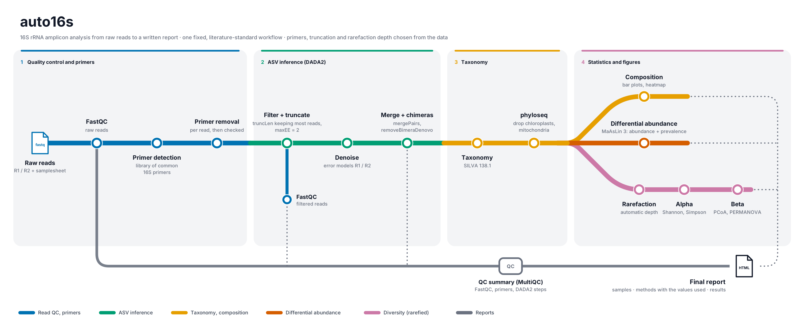

# auto16s

[](https://github.com/ozlemsagiroglu/auto16s/actions/workflows/ci.yml)
[](https://www.nextflow.io/)
[](https://www.docker.com/)
[](https://apptainer.org/)
[](https://docs.conda.io/en/latest/)
[](LICENSE)

**auto16s** analyses paired-end 16S rRNA amplicon data, from raw FASTQ files to statistics and publication-ready figures, in one fixed workflow.

It is built for the common case: one Illumina run and a comparison between groups. There are no alternative routes to choose from. The steps and their settings follow the standard DADA2-based workflow used in the microbiome literature. The pipeline determines from the data what usually has to be looked up by hand: which primers are in the reads, where to truncate, and how deep to rarefy. Every decision is shown in the report.

The only required input is a samplesheet.



## Contents

- [Pipeline summary](#pipeline-summary)
- [Quick start](#quick-start)
- [Input](#input)
- [Parameters and defaults](#parameters-and-defaults)
- [What the pipeline decides from the data](#what-the-pipeline-decides-from-the-data)
- [Quality filtering](#quality-filtering)
- [Outputs](#outputs)
- [Statistics](#statistics)
- [Figures](#figures)
- [Reading the report](#reading-the-report)
- [Scope and limitations](#scope-and-limitations)
- [Testing](#testing)
- [Citations](#citations)
- [License](#license)

## Pipeline summary

1. **Read QC** of the raw reads ([FastQC](https://www.bioinformatics.babraham.ac.uk/projects/fastqc/))
2. **Primer detection**: the read starts are matched against a library of common 16S primers ([`assets/primers_16s.tsv`](assets/primers_16s.tsv)).
3. **Primer removal**, per read and by sequence. This handles variable-length spacers before the primer and pairs in reverse orientation. Pairs without both primers are dropped. Afterwards every read is checked again for the primer, so the report shows whether removal worked.
4. **ASV inference** ([DADA2](https://benjjneb.github.io/dada2/)):
   - quality filtering with automatic `truncLen` and `maxEE`;
   - error models for R1 and R2;
   - denoising;
   - `mergePairs`;
   - consensus chimera removal.

   The filtered and truncated reads go through FastQC a second time, so the report shows the quality before and after filtering side by side.
5. **Taxonomy**: DADA2 `assignTaxonomy` against [SILVA 138.1](https://doi.org/10.5281/zenodo.4587955).
6. **phyloseq object** ([phyloseq](https://joey711.github.io/phyloseq/)). Unassigned, eukaryotic, chloroplast and mitochondrial ASVs are removed, then rarefaction at an automatically chosen depth.
7. **Composition**: phylum, family and genus bar plots per sample and per group, plus a genus heatmap (all reads).
8. **Alpha diversity**: Observed, Shannon and Simpson, with Wilcoxon or Kruskal-Wallis tests (rarefied).
9. **Beta diversity**: Bray-Curtis PCoA, PERMANOVA, betadisper and pairwise PERMANOVA ([vegan](https://github.com/vegandevs/vegan); rarefied).
10. **Differential abundance and prevalence** at genus level ([MaAsLin 3](https://huttenhower.sph.harvard.edu/maaslin3/); all reads).
11. **Report** ([MultiQC](https://multiqc.info/)): QC, warnings, all key figures and test results in one HTML file.

## Quick start

1. Install [Nextflow](https://www.nextflow.io/docs/latest/install.html) (≥ 25.04, Java 17+) and **one** of the software stacks below. On Windows, use [WSL](https://learn.microsoft.com/en-us/windows/wsl/install).

2. Test the installation (8 small samples, a few minutes). Nextflow downloads the pipeline from GitHub:

   ```bash
   nextflow run ozlemsagiroglu/auto16s -profile test,docker      # or test,singularity / test,conda
   ```

3. Create the samplesheet from your FASTQ folder, then fill in the `group` column ([details](#input)):

   ```bash
   nextflow run ozlemsagiroglu/auto16s --input raw/
   ```

4. Run your data:

   ```bash
   nextflow run ozlemsagiroglu/auto16s -profile docker --input samplesheet.csv --outdir results
   ```

5. Open `results/multiqc/multiqc_report.html`. Read the **"DADA2 summary and warnings"** table first.

Add `-resume` to rerun after a change; finished steps are reused. Add `-r v0.4.0` to run a fixed release.

### Software stacks: Docker is not required

All tools come either from containers or from Conda. Choose the profile that matches what is installed:

| Profile | Needs | Notes |
|---|---|---|
| `docker` | Docker | Simplest on a laptop or workstation |
| `singularity` / `apptainer` | Singularity or Apptainer | **No Docker needed.** Usual choice on HPC clusters; the same images are pulled and converted automatically |
| `conda` | Conda / Mamba / Miniforge | **No containers at all.** Environments are created on the first run (this takes a while once) |

The tools of the R analysis steps (phyloseq, vegan, MaAsLin 3, ggplot2) are in the image `ghcr.io/ozlemsagiroglu/auto16s-r`, built from [`containers/r-analysis`](containers/r-analysis) and published automatically. Nothing has to be built by hand. For offline clusters, the image can be built without Docker:

```bash
cd containers/r-analysis && apptainer build auto16s-r.sif auto16s-r.def
nextflow run ozlemsagiroglu/auto16s -profile singularity --r_container $PWD/auto16s-r.sif --input samplesheet.csv
```

**Without any container or Conda**, the pipeline also runs on a machine where FastQC, MultiQC and R are installed. It needs R ≥ 4.4 with dada2, phyloseq, vegan, maaslin3 and ggplot2; the R packages can be installed with `Rscript containers/r-analysis/install_r_packages.R` (plus `BiocManager::install("dada2")`). Then run without `-profile`.

## Input

The pipeline needs one table, the **samplesheet**. It tells the pipeline which FASTQ files belong to which sample and which group each sample is in. One row per sample.

### Let the pipeline write it

Point `--input` to the folder with your FASTQ files:

```bash
nextflow run ozlemsagiroglu/auto16s --input raw/
```

The pipeline:
- pairs the R1 and R2 files by their names;
- writes `samplesheet.csv` in the current folder, with the `group` column left empty;
- stops.

Fill in the group of every sample (for example `control` or `patient`), then start the analysis:

```bash
nextflow run ozlemsagiroglu/auto16s -profile docker --input samplesheet.csv
```

File names it recognises: `S1_R1.fastq.gz`/`S1_R2.fastq.gz`, `S1_1.fq.gz`/`S1_2.fq.gz`, `S1.R1.fastq`, and Illumina's `S1_S1_L001_R1_001.fastq.gz`; the last one becomes sample `S1`. Sample names are cleaned automatically: characters such as `ş`, `ç` or spaces are replaced, and a name that starts with a digit gets an `S` in front. Files without a partner are listed and left out.

### Or write it yourself

Example: a project folder

```
project/
├── samplesheet.csv
└── raw/
    ├── K1_R1.fastq.gz    K1_R2.fastq.gz
    ├── K2_R1.fastq.gz    K2_R2.fastq.gz
    ├── P1_R1.fastq.gz    P1_R2.fastq.gz
    └── P2_R1.fastq.gz    P2_R2.fastq.gz
```

and its `samplesheet.csv`:

```csv
sample,fastq_1,fastq_2,group,age,sex
K1,raw/K1_R1.fastq.gz,raw/K1_R2.fastq.gz,control,34,F
K2,raw/K2_R1.fastq.gz,raw/K2_R2.fastq.gz,control,41,M
P1,raw/P1_R1.fastq.gz,raw/P1_R2.fastq.gz,patient,38,F
P2,raw/P2_R1.fastq.gz,raw/P2_R2.fastq.gz,patient,45,M
```

| Column | What to write | Rules |
|---|---|---|
| `sample` | Name of the sample; it is used in every table and figure | Must start with a letter; English letters, digits, `.`, `_` and `-` only (no spaces). Each name once |
| `fastq_1` | Path to the sample's **R1** (forward) file | `.fastq.gz`, `.fq.gz`, `.fastq` or `.fq` |
| `fastq_2` | Path to the sample's **R2** (reverse) file | same |
| `group` | Group the sample belongs to (control, patient, treatment, …) | At least 2 groups; 3 or more samples per group recommended. Spelling must match exactly: `Control` and `control` are two different groups. Another column can be used with `--group_col` |
| other columns | Optional, e.g. age or sex | Not used in the analysis; kept in the phyloseq object for your own analyses in R |

The first line must contain the column names exactly as above.

**File paths** can be written in two ways:
- **relative** to the samplesheet's folder, as in the example (`raw/K1_R1.fastq.gz`); the project folder can then be moved anywhere;
- **absolute**, e.g. `/home/user/project/raw/K1_R1.fastq.gz`. On Windows with WSL, write `/mnt/c/Users/...`, not `C:\...`.

Avoid spaces in folder and file names.

**Excel works too.** Columns may be separated by commas, semicolons (what Excel writes with Turkish and most European language settings) or tabs; the separator is recognised automatically. "Save as CSV" from Excel is fine.

**Checks before anything runs.** The pipeline stops with a clear message on:
- missing columns, duplicate or invalid sample names;
- files that do not exist or are not FASTQ;
- empty groups, or fewer than 2 groups.

It warns about groups with fewer than 3 samples, and prints the number of samples per group at the start.

## Parameters and defaults

**Required:** `--input`: the samplesheet, or a folder of FASTQ files to create one (see [Input](#input)).

**Optional**, only if needed:

| Parameter | Default | Description |
|---|---|---|
| `--outdir` | `results` | Output folder |
| `--group_col` | `group` | Samplesheet column with the groups |
| `--maaslin_reference` | alphabetically first group | Reference group for MaAsLin 3 coefficients |
| `--silva_db` | SILVA 138.1 training set, downloaded from Zenodo | Local copy, to avoid downloading in every new run |
| `--fw_primer`, `--rv_primer` | detected | Primer sequences (5'→3', IUPAC), only if your primers are not in the library |
| `--trunc_len_f`, `--trunc_len_r` | automatic | Fixed truncation lengths |
| `--rarefy_depth` | automatic | Fixed rarefaction depth |
| `--max_cpus`, `--max_memory`, `--max_time` | all CPUs and all memory of the machine, `24.h` | Upper limits per task. Tasks never ask for more than these, so the pipeline also runs on a laptop |

**Settings applied in every run.** These are literature-standard values, stored in [`nextflow.config`](nextflow.config):

| Step | Setting | Value |
|---|---|---|
| Primer removal | primer start | within the first 12 bases of the read |
| | mismatches allowed | 1 (primer < 20 nt) or 2 (≥ 20 nt), IUPAC codes honoured |
| DADA2 `filterAndTrim` | `truncLen` | automatic (see below) |
| | `maxEE` | 2 (R1 and R2) |
| | `truncQ`, `maxN`, `rm.phix` | 2, 0, `TRUE` |
| DADA2 `mergePairs` | `minOverlap`, `trimOverhang` | 12, `TRUE` |
| Chimera removal | `removeBimeraDenovo` | `consensus` |
| Taxonomy | `assignTaxonomy` `minBoot` | 50 |
| Rarefaction | depth, seed | automatic (see below), 711 |
| PERMANOVA / betadisper | permutations | 999 |
| MaAsLin 3 | models, normalisation, transform | abundance (linear) + prevalence (logistic), TSS, LOG |
| | `min_prevalence`, significance | 0.1, q < 0.05 (`qval_individual`, Benjamini-Hochberg) |
| Bar plots | taxa shown | top 12 by mean relative abundance + "Other" |

## What the pipeline decides from the data

### Primers

The first reads of every sample are matched against [`assets/primers_16s.tsv`](assets/primers_16s.tsv). The list has 20 widely used 16S primers, among them 27F, 341F, 515F, 515F-Y, 799F, 805R, 806R, 806RB, 926R and 1193R. The forward/reverse pair found in most read pairs is selected and removed from every read by sequence, which also handles:

- **spacers**: variable-length bases before the primer ("heterogeneity spacers", phased primers);
- **mixed orientation**: pairs whose R1 starts with the reverse primer, as in some ligation-based libraries, are swapped.

Pairs that do not carry both primers are removed; they are usually off-target products. The detected primers, the share of read pairs that carry them and a per-sample summary are in `primers/` and in the report.

If no known primer pair is found, the pipeline assumes the primers were already removed by the sequencing provider and uses the reads as they are. The report then shows the most common read start, so an unlisted primer can be recognised. Give such a primer with `--fw_primer`/`--rv_primer`, or add one line to the TSV.

### Truncation length (`truncLen`)

The truncation length is computed from the reads themselves. FastQC is only for viewing. On the first reads of every sample, after primer removal, the pipeline:

1. computes the median quality per position and truncates where it drops below Q25;
2. estimates the amplicon length by aligning R1 to the reverse complement of R2;
3. checks that R1 and R2 still overlap by at least 20 bp after truncation; if not, it truncates less.

Step 3 matters because a too-short truncation is the most common reason why read pairs silently fail to merge in DADA2. The quality profile, the chosen positions and the expected overlap are shown in `dada2/dada2_quality_truncation.png`.

### Rarefaction depth

Rarefaction is used for alpha and beta diversity only. The depth is the smallest depth among samples with at least 1,000 reads and at least 10 % of the median depth. One failed sample therefore cannot force all others down to a few hundred reads. Samples below the depth are left out of alpha and beta diversity and listed in the report. Composition and MaAsLin 3 use all samples and all reads.

## Quality filtering

Quality control is done by DADA2 rather than a separate trimmer, so it may help to know how it compares with Trimmomatic.

| | Trimmomatic | DADA2 (this pipeline) |
|---|---|---|
| Low-quality 3' end | cut per read (sliding window) → reads of different lengths | cut at the same position in every read (`truncLen`) |
| Read with many errors | kept if no window falls below the threshold | **removed** if its expected number of errors exceeds 2 (`maxEE`) |
| Single low-quality bases | cut the read there | kept; handled by the error model learned from the run |

The expected number of errors of a read is the sum of the error probabilities of its bases (Q30 = 0.001, Q20 = 0.01, Q10 = 0.1). It measures the error load of the whole read, which a sliding window does not. Reads of equal length are a requirement of DADA2's denoising, not a cosmetic choice. The few single errors that remain are corrected by the denoising itself; correcting them is what an ASV method does.

On the test data (sample S01, 2,500 read pairs):

| | Kept (72 %) | Removed (28 %) |
|---|---|---|
| Median expected errors R1 / R2 | 0.24 / 0.22 | 3.84 / 1.52 |
| Mean quality R1 / R2 | Q36.4 / Q35.9 | Q28.7 / Q31.5 |
| Bases below Q20 (median, R1 / R2) | 1.3 % / 1.4 % | 19.2 % / 11.9 % |

None of the kept pairs exceeds 2 expected errors. Every removed pair would also have been trimmed by a `SLIDINGWINDOW:4:20` check. About half of the kept pairs contain a short dip below Q20 that Trimmomatic would have cut. DADA2 keeps them because their overall error load is low (median 0.8 expected errors).

## Outputs

All results are in `--outdir`. Besides the figures, every number behind a figure is delivered as a table, and the full data as phyloseq objects, so you can make your own figures or analyses.

| Folder | Content |
|---|---|
| `multiqc/` | `multiqc_report.html`: everything in one report |
| `phyloseq/` | `phyloseq_object.rds` (all reads), `phyloseq_object_rarefied.rds`, ASV tables (raw and rarefied), taxonomy, ASV sequences (FASTA), sample metadata, depths, rarefaction curves |
| `composition/` | Counts and relative abundances per phylum, family and genus; bar plots; genus heatmap |
| `alpha_diversity/` | Values per sample, tests, figure |
| `beta_diversity/` | Bray-Curtis distance matrix, PCoA coordinates, PERMANOVA, betadisper, interpretation, figures |
| `maaslin3/` | All results and significant genera (CSV), volcano, coefficient plot, abundance and prevalence plots, raw MaAsLin 3 output |
| `primers/` | Detected primers, detection plot, per-sample primer statistics |
| `dada2/` | Summary and warnings, read tracking, truncation, error models, ASV lengths, sequence table |
| `taxonomy/` | SILVA assignment per ASV sequence |
| `fastqc/` | FastQC reports: `raw/` before and `filtered/` after DADA2 quality filtering |
| `pipeline_info/` | Nextflow execution report, timeline, trace |

Each file is described in [docs/output.md](docs/output.md). Figures are saved as PNG (300 dpi) and PDF.

**Continuing in R**

```r
library(phyloseq)
ps      <- readRDS("results/phyloseq/phyloseq_object.rds")            # all reads
ps_rare <- readRDS("results/phyloseq/phyloseq_object_rarefied.rds")   # rarefied

sample_data(ps)                       # your samplesheet columns
plot_bar(tax_glom(ps, "Phylum"), fill = "Phylum")

genus <- read.delim("results/composition/genus_relative_abundance.tsv", row.names = 1, check.names = FALSE)
```

## Statistics

| Analysis | Data | Method |
|---|---|---|
| Alpha diversity | rarefied | 2 groups: Wilcoxon rank-sum. More than 2: Kruskal-Wallis and pairwise Wilcoxon, Benjamini-Hochberg |
| Beta diversity | rarefied | Bray-Curtis; PERMANOVA (`adonis2`) and `betadisper`. More than 2 groups: pairwise PERMANOVA, Benjamini-Hochberg |
| Differential abundance and prevalence | all reads, genus level | MaAsLin 3 (TSS, LOG; abundance and prevalence models), Benjamini-Hochberg q-values |

PERMANOVA cannot tell a shift in composition from a difference in within-group spread. The pipeline therefore reads it together with betadisper and writes the interpretation into the report. Rarefying for alpha and beta diversity, but not for differential abundance, follows current recommendations (Schloss 2024).

**Why MaAsLin 3 reports two kinds of results.** A genus can differ between groups in two ways: it is present in fewer samples of one group (*prevalence*), or it is present everywhere but less abundant (*abundance*). Older methods, including MaAsLin2, mix the two, because absent genera enter the model as zeros. MaAsLin 3 tests them separately: the abundance model uses only the samples in which the genus was found, the prevalence model only whether it was found. Every significant result is therefore labelled `abundance` or `prevalence`. Following the MaAsLin 3 defaults, abundance coefficients are tested against the median coefficient of all genera rather than against zero, which corrects for the compositional nature of relative abundances.

## Figures

All figures are made with ggplot2. Colours are fixed, so a group or a taxon looks the same in every figure:

| Element | Colours |
|---|---|
| Groups | Okabe-Ito palette (colour-blind safe), in alphabetical order of group names |
| Taxa in bar plots | 20 distinct colours by abundance rank; "Other" in grey |
| Heatmap | viridis, log10 relative abundance |
| MaAsLin 3 | orange = higher, blue = lower than the reference group |

## Reading the report

The report starts with **DADA2 summary and warnings**. Possible warnings:

| Warning | Most likely cause |
|---|---|
| No known 16S primer pair found | Primers were already removed (fine), or a primer that is not in the library. Check the reported read start |
| Only x % of read pairs carry the primers | Off-target products, or a primer variant not in the library |
| < 80 % of reads survived chimera removal | Primers still in the reads |
| Median merge rate < 70 % | Reads too short to overlap after truncation |
| Primer still found in > 1 % of reads after removal | A primer variant that is not in the library, or very long spacers |

**Did filtering work?** The report has two FastQC sections, *raw reads* and *after DADA2 filtering*. After filtering, all reads of a sample have the same length, the low-quality 3' ends are gone and the per-base quality stays high to the end of the read. The section **Primer removal check** lists, per sample, the share of reads that still contain the primer after removal; it should be close to 0 %.

Merged reads cannot be checked with FastQC, because DADA2 merges the denoised sequences (ASVs), not the reads. The merge is checked by the read tracking table (reads lost at merging) and the ASV length plot below.

**Sanity check: ASV length.** `dada2/dada2_asv_length.png` should show one main peak at the length of your region without primers (e.g. V4 ≈ 253 bp, V3-V4 ≈ 400–430 bp). Small peaks far from it are usually off-target products.

## Troubleshooting

| Message | Solution |
|---|---|
| `Process requirement exceeds available memory` | Only with older versions: update with `nextflow pull ozlemsagiroglu/auto16s`. The pipeline now limits every task to the memory of the machine. To keep memory free for other work, set a lower limit, e.g. `--max_memory 6.GB` |
| DADA2 is killed (exit status 137 or 143, `Out of memory` in `journalctl`) | DADA2 already uses at most one thread per 2 GB of free memory. If it still runs out, lower the threads with `--max_cpus 2`, close other programs or, under WSL, raise the memory limit in `%UserProfile%\.wslconfig` (`[wsl2]` / `memory=12GB`) and run `wsl --shutdown`. Then add `-resume` |
| A run stops halfway | Fix the cause and run the same command again with `-resume`; finished steps are not repeated |

## Scope and limitations

The workflow is deliberately fixed and assumes:

- **One Illumina paired-end run.** DADA2's error model is run-specific; samples from different runs should not be combined in one analysis.
- **Primers from the built-in list**, or given with `--fw_primer`/`--rv_primer`.
- **No negative controls.** If extraction or PCR blanks were sequenced, contaminant removal (e.g. [decontam](https://github.com/benjjneb/decontam)) is standard and is not included.
- **No phylogenetic tree,** so UniFrac and Faith's PD are not computed.
- **A comparison between groups.** Covariates and paired or repeated-measures designs are not modelled; use the phyloseq objects in R for those.
- **One differential abundance method.** Differential abundance methods can give different results on the same data (Nearing et al. 2022). Report MaAsLin 3 results as such.
- **Small groups.** Permutation tests cannot produce small p-values with very few samples. With 3 vs 2 samples there are only 10 distinct permutations, so p ≥ 0.1.

For other designs, data types or analyses, [nf-core/ampliseq](https://nf-co.re/ampliseq) offers many more options.

## Testing

`-profile test` runs real reads: the V4 example data shipped with DADA2 (2×250 bp), with 515F-Y/806RB primers added and their degenerate bases resolved per read. It has 8 samples in 2 groups with a built-in difference in composition. Two other scenarios can be generated with the same script:

```bash
Rscript tests/make_test_data.R tests/data_spacer spacer     # 0-7 nt spacers, half of the pairs reverse-oriented
Rscript tests/make_test_data.R tests/data_noprimer none     # primers already removed
nextflow run main.nf -profile docker --input tests/data_spacer/samplesheet.csv \
    --silva_db tests/data/example_train_set.fa.gz
```

In all three, the primers are found (or correctly reported as absent), the amplicon length is estimated at 253 bp (V4), and no reads are lost to chimeras.

## Citations

If you use auto16s, please cite the tools it relies on:

- **Nextflow**: Di Tommaso P. et al. (2017). Nextflow enables reproducible computational workflows. *Nat Biotechnol* 35:316–319.
- **FastQC**: Andrews S. (2010). FastQC: a quality control tool for high throughput sequence data.
- **DADA2**: Callahan B.J. et al. (2016). DADA2: high-resolution sample inference from Illumina amplicon data. *Nat Methods* 13:581–583.
- **SILVA**: Quast C. et al. (2013). The SILVA ribosomal RNA gene database project. *Nucleic Acids Res* 41:D590–D596.
- **SILVA for DADA2**: McLaren M.R., Callahan B.J. (2021). SILVA 138.1 prokaryotic SSU taxonomic training data formatted for DADA2. Zenodo. doi:10.5281/zenodo.4587955
- **phyloseq**: McMurdie P.J., Holmes S. (2013). phyloseq. *PLoS ONE* 8:e61217.
- **vegan**: Oksanen J. et al. vegan: Community Ecology Package.
- **betadisper**: Anderson M.J. (2006). Distance-based tests for homogeneity of multivariate dispersions. *Biometrics* 62:245–253.
- **MaAsLin 3**: Nickols W.A. et al. (2026). MaAsLin 3: refining and extending generalized multivariate linear models for meta-omic association discovery. *Nat Methods*.
- **MultiQC**: Ewels P. et al. (2016). MultiQC. *Bioinformatics* 32:3047–3048.
- **ggplot2**: Wickham H. (2016). *ggplot2: Elegant Graphics for Data Analysis*. Springer.

Background for design choices:

- Klindworth A. et al. (2013). Evaluation of general 16S ribosomal RNA gene PCR primers. *Nucleic Acids Res* 41:e1.
- Schloss P.D. (2024). Rarefaction is currently the best approach to control for uneven sequencing effort in amplicon sequence analyses. *mSphere*.
- Nearing J.T. et al. (2022). Microbiome differential abundance methods produce different results across 38 datasets. *Nat Commun* 13:342.

## License

auto16s is released under the [MIT License](LICENSE). The tools it runs keep their own licenses.
